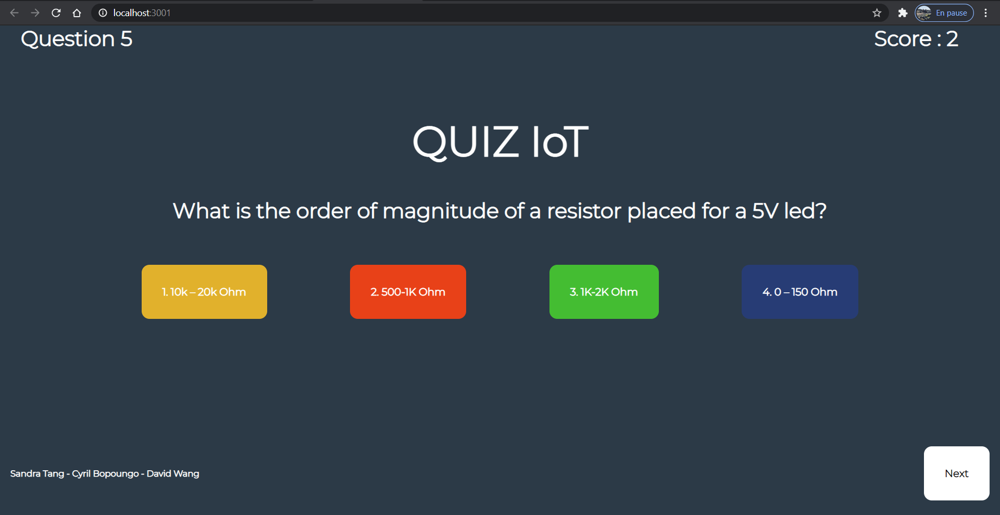
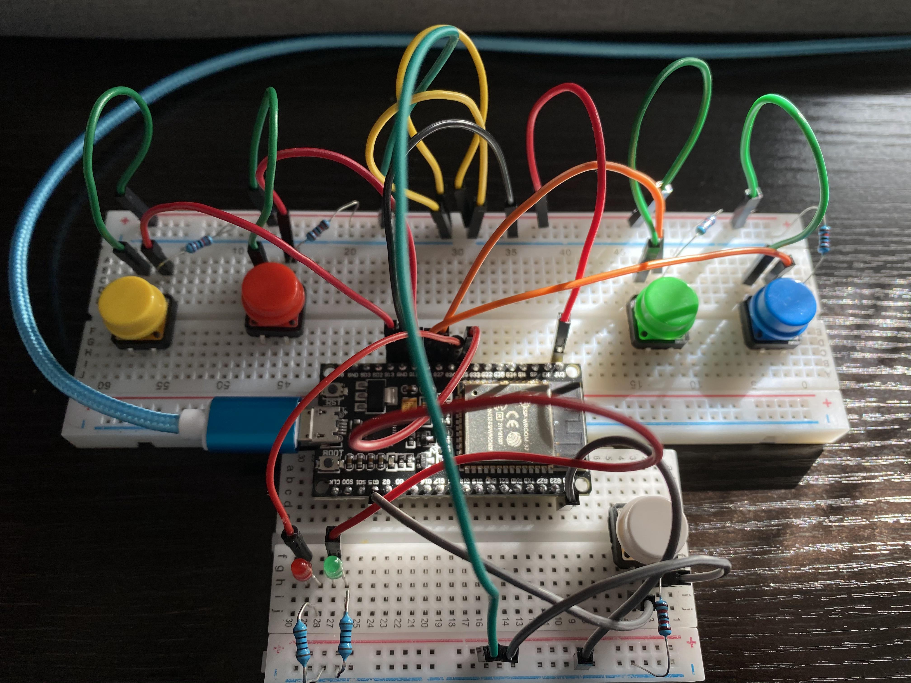

# QUIZ-IOT
A connected object that can play a game by answering (press the buttons) the questions shown on a dynamic web page. 


Preview : 


Circuit : 



## Installation

Install : 

-   [ReactJS](https://reactjs.org/) 
-   [Node](https://nodejs.org/en/) 11.4.0+ 


Clone/fork the project and :


__npm install && npm start__ to launch the application.


__Frontend__
```bash
$ npm install && npm start
```


